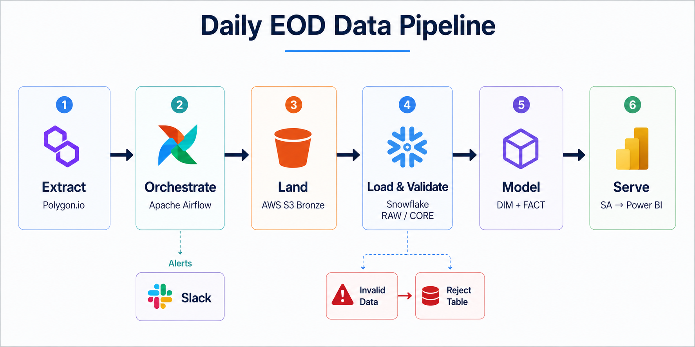

# Automated EOD Securities Pricing Platform

> An end-to-end batch data platform for ingesting U.S. securities EOD pricing data, processing it through AWS S3 and Snowflake, and delivering curated liquidity and performance analytics through Power BI.

**Polygon.io · Python · Apache Airflow · AWS S3 · Snowflake · SQL · Docker · Power BI · Slack**


---

## Overview

The **Automated EOD Securities Pricing Platform** automates the ingestion, validation, transformation, and analytical delivery of U.S. securities end-of-day pricing and liquidity data.

The platform replaces a manual workflow of collecting market-data files and preparing reports by establishing a scheduled batch pipeline that moves data from **Polygon.io → AWS S3 → Snowflake → Power BI**.

The pipeline supports both **historical backfill** and **daily incremental processing**, with Snowflake providing layered storage and transformation across RAW, CORE, dimensional, fact, and Subject Area layers.

The final curated datasets support market liquidity analysis, sector-level liquidity contribution, ETF activity, equity performance, daily returns, and watchlist monitoring.

---

## Key Capabilities

| Capability             | Implementation                                                       |
| ---------------------- | -------------------------------------------------------------------- |
| Historical Backfill    | Python-based extraction of historical EOD market data                |
| Daily Ingestion        | Scheduled Airflow DAG for weekday EOD processing                     |
| Trading-Day Resolution | Automatically searches backward for the latest available trading day |
| Cloud Landing          | AWS S3 Bronze layer for raw CSV files                                |
| Warehouse Ingestion    | Snowflake external stage and `COPY INTO`                             |
| Data Quality           | Validation, deduplication, and rejected-record handling              |
| Incremental Processing | Snowflake `MERGE`-based upserts                                      |
| Data Modeling          | Security and Date dimensions with a daily pricing fact table         |
| Analytical Layer       | Curated Subject Area views for BI consumption                        |
| Monitoring             | Airflow retries, pre/post-load metrics, and Slack notifications      |
| BI Delivery            | Power BI dashboards for market and liquidity insights                |

---

## Architecture

The platform follows a layered batch-processing architecture designed to separate ingestion, transformation, analytical modeling, and business consumption.

### High-Level Flow

```text
Polygon.io
    ↓
Apache Airflow
    ↓
AWS S3 — Bronze
    ↓
Snowflake RAW
    ↓
CORE
    ↓
DIMENSIONS + FACT
    ↓
SA / Subject Area
    ↓
Power BI
```

Airflow orchestrates the daily workflow, while Snowflake performs the warehouse-side validation, transformation, dimensional modeling, and analytical preparation.

Slack is integrated with Airflow for task-failure alerts and end-of-run summaries.


---

## Historical Backfill

The historical load establishes the initial dataset required for downstream analytical processing.

A Python extraction script calls the Polygon grouped U.S. stock endpoint across the configured historical date range and writes the results into a structured CSV containing:

* Trading date
* Symbol
* Open
* High
* Low
* Close
* Volume
* Source file metadata
* Ingestion timestamp

The historical dataset is then loaded into Snowflake and transformed through the warehouse layers.

```text
Polygon.io
    ↓
Python Extraction
    ↓
Historical CSV
    ↓
Snowflake RAW
    ↓
CORE
    ↓
DIMENSIONS
    ↓
FACT_DAILY_PRICE
```

The historical transformation establishes the same dimensional and fact structure used by the daily pipeline, providing a consistent foundation for downstream analytics.

---

## Daily Incremental Pipeline

The daily pipeline is orchestrated through Apache Airflow and runs on weekdays to process the latest available U.S. market trading data.

### Pipeline Flow

1. **Resolve Trading Day**
   The pipeline checks the current date and searches backward within a configurable lookback window until Polygon.io returns valid EOD data.

2. **Extract Data**
   The latest available grouped EOD market data is downloaded and written to a temporary CSV file.

3. **Validate Local File**
   Airflow verifies that the expected file was successfully created before continuing.

4. **Land in S3**
   The CSV is uploaded to the S3 Bronze path using the Airflow AWS integration.

5. **Load Snowflake RAW**
   Snowflake accesses the S3 Bronze location through an external stage and loads the file into the RAW layer.

6. **Run Pre-Merge Checks**
   The pipeline calculates row counts, rejected records, and estimated CORE inserts and updates.

7. **Merge into CORE**
   Records are normalized and deduplicated before being merged into the canonical CORE table.

8. **Update Dimensions**
   Security and Date dimensions are maintained from the CORE dataset.

9. **Merge Fact Data**
   Daily pricing records are loaded into `FACT_DAILY_PRICE` at the grain of Security + Trading Date.

10. **Run Post-Merge Checks**
    CORE and FACT row counts are calculated after processing.

11. **Send Slack Summary**
    The completed run publishes key processing metrics to Slack.



---

## Data Quality & Reliability

Data quality checks are built into the ingestion and transformation workflow rather than being treated as a separate reporting step.

### Validation

The pipeline identifies invalid records such as negative trading volume and routes them to a dedicated reject table:

```text
RAW
 │
 ├── Valid records ───────→ CORE
 │
 └── Invalid records ─────→ EOD_PRICES_REJECT
```

Rejected records retain useful diagnostic information including:

* Trading date
* Symbol
* OHLCV values
* Rejection reason
* Source file
* Original ingestion timestamp
* Rejection timestamp

### Deduplication

The CORE transformation uses `ROW_NUMBER()` over:

```text
SYMBOL + TRADE_DATE
```

and retains the latest record based on ingestion timestamp and source file ordering.

### Incremental Upserts

Snowflake `MERGE` operations update existing records and insert new records instead of blindly appending repeated data.

### Operational Metrics

The Airflow workflow tracks:

* RAW row count
* Reject count
* Estimated CORE inserts
* Estimated CORE updates
* CORE rows after merge
* FACT rows after merge

---

## Snowflake Data Model

The Snowflake warehouse follows a layered analytical model:

```text
RAW
 ↓
CORE
 ↓
DIMENSIONS + FACT
 ↓
SA
```

### RAW

`RAW_EOD_PRICES` stores the source EOD pricing records together with source-file and ingestion metadata.

### CORE

`EOD_PRICES` provides the cleaned and deduplicated canonical pricing dataset.

`EOD_PRICES_REJECT` stores records that fail defined data-quality checks.

### Dimensions

**`DIM_SECURITY`**

Maintains the security-level business entity and surrogate security key.

**`DIM_DATE`**

Provides reusable calendar attributes including year, quarter, month, week, day, and weekend indicators.

**`DIM_SECURITY_ATTRIBUTES`**

Provides descriptive attributes used by the analytical layer, including security name, type, sector, industry, and website.

### Fact

**`FACT_DAILY_PRICE`**

Stores daily EOD pricing at the grain of:

> **One security × one trading date**

The fact contains Open, High, Low, Close, and Volume measures.


---

## Analytics Layer

The Subject Area (`SA`) layer exposes business-ready views designed for downstream BI consumption.

The platform currently provides views for:

| Analytical View                     | Purpose                                                                  |
| ----------------------------------- | ------------------------------------------------------------------------ |
| `VW_SECURITY_DAILY_PRICES`          | Business-ready daily OHLCV data enriched with security attributes        |
| `VW_TOP20_EQUITY_BY_VOLUME_DAILY`   | Daily top-20 equities by trading volume and traded value                 |
| `VW_WATCHLIST_HISTORY`              | Historical pricing and liquidity metrics for selected watchlist equities |
| `VW_SECURITY_LAST_30D_DAILY_RETURN` | Recent daily returns using prior-close calculations                      |
| `VW_SECTOR_LIQUIDITY_LATEST`        | Latest-day sector liquidity and contribution analysis                    |
| `VW_ETF_LIQUIDITY_30D_SUMMARY`      | 30-day ETF liquidity averages and ranking                                |

This keeps business-facing logic in curated Snowflake views instead of requiring Power BI to reconstruct the underlying warehouse model.

---

## Power BI Analytics

The curated SA views are consumed by Power BI to provide market and liquidity insights across two main analytical areas.

### Market Liquidity Overview

The dashboard provides visibility into:

* Sector-wise liquidity contribution
* Total traded value
* Market liquidity by sector
* ETF liquidity trends
* 30-day ETF liquidity ranking


### Equity Performance & Watchlist Insights

The second dashboard focuses on:

* Daily return trends
* Equity OHLC pricing
* Top equities by daily volume
* Traded value
* Watchlist performance
* Equity and ETF contribution


### Full Dashboard

The complete Power BI report is also available as a PDF:

**[View the complete Power BI dashboard](powerbi/securities_market_insights.pdf)**

The original Power BI `.pbix` file is included in the repository for reference.

---

## Monitoring & Alerting

The pipeline includes operational monitoring through Apache Airflow and Slack.

### Airflow

The DAG is configured with:

* 3 task retries
* 5-minute retry delay
* Single active DAG run
* Failure callback
* XCom-based trading-date propagation
* Task dependency management through a Snowflake TaskGroup

### Slack

Two notification paths are implemented:

**Failure Alerts**

When an Airflow task fails, Slack receives:

* DAG ID
* Task ID
* Run ID
* Error information
* Airflow log link

**EOD Summary**

After the Snowflake processing stage, the pipeline publishes a summary containing:

* Trading date
* RAW rows
* Reject rows
* Estimated CORE inserts
* Estimated CORE updates
* CORE rows
* FACT rows

This provides a lightweight operational view of each daily run without requiring manual inspection of every Airflow task.

---

## Technology Stack

| Category              | Technologies                               |
| --------------------- | ------------------------------------------ |
| Data Source           | Polygon.io                                 |
| Programming           | Python, SQL                                |
| Orchestration         | Apache Airflow                             |
| Cloud Storage         | AWS S3                                     |
| Data Warehouse        | Snowflake                                  |
| Data Modeling         | Dimensional Modeling, Star Schema          |
| Data Quality          | Validation, Deduplication, Reject Handling |
| Containerization      | Docker                                     |
| Monitoring            | Slack                                      |
| Business Intelligence | Power BI                                   |


## Repository Structure

```text
automated-eod-securities-pricing/
│
├── dags/
│   ├── get_securities_data.py
│   ├── lib/
│   │   ├── eod_data_downloader.py
│   │   └── slack_utils.py
│   └── sql/
│       ├── 1. copy_to_raw.sql
│       ├── 2. check_loaded.sql
│       ├── 3. premerge_metrics.sql
│       ├── 4. merge_core.sql
│       ├── 5. merge_dim_security.sql
│       ├── 6. dm_dim_date.sql
│       ├── 7. merge_fact_daily_price.sql
│       └── 8. postmerge_metrics.sql
│
├── historical_load/
│   ├── extract_historical_data.py
│   └── load_transform_historical_data.sql
│
├── snowflake/
│   ├── init_snowflake_objects.sql
│   ├── load_daily_eod_prices.sql
│   ├── reject_table.sql
│   └── sec_pricing_views.sql
│
├── powerbi/
│   ├── securities_market_insights.pbix
│   ├── securities_market_insights.pdf
│   ├── market_liquidity_overview.png
│   └── equity_watchlist_insights.png
│
├── docs/
│   ├── architecture.png
│   ├── data_model.png
│   ├── daily_eod_data_pipeline.png
│   └── test_scripts/
│       ├── test_aws_conn.py
│       ├── test_slack_conn.py
│       └── test_snowflake_conn.py
│
├── .env.example
├── .gitignore
├── docker-compose.yaml
├── LICENSE
└── README.md
```

---

## Setup & Configuration

### Prerequisites

Before running the project locally, install:

* Docker Desktop
* Git
* Access to a Polygon.io API key
* AWS credentials with access to the configured S3 bucket
* Snowflake account credentials
* Slack Incoming Webhook configuration

### 1. Clone the Repository

```bash
git clone https://github.com/JacobDaniel-82/automated-eod-securities-pricing.git

cd automated-eod-securities-pricing
```

### 2. Configure Environment Variables

Create a local `.env` file based on the provided template:

```bash
cp .env.example .env
```

Populate the required values locally.

**Do not commit `.env` or any credentials to GitHub.**

### 3. Start Airflow

The project uses the official Apache Airflow Docker image with a CeleryExecutor-based local environment.

Start the services with:

```bash
docker compose up -d
```

The Compose configuration starts the Airflow API server, scheduler, DAG processor, worker, triggerer, PostgreSQL metadata database, and Redis broker.

### 4. Access Airflow

Open:

```text
http://localhost:8080
```

Use the credentials configured through the local environment.

### 5. Configure Airflow Connections and Variables

The DAG expects configuration for:

* Polygon API key
* S3 bucket
* Lookback window
* AWS connection
* Snowflake connection
* Slack connection

These should be configured through the Airflow UI/connection system rather than hard-coded into the DAG.

### 6. Run the Pipeline

Enable the EOD DAG:

```text
polygon_eod_data_downloader_final_v2
```

The DAG resolves the latest available trading day, extracts the data, uploads it to S3, loads Snowflake, performs transformations, and sends the resulting status to Slack.

---

## Project Outcomes

The completed platform demonstrates an end-to-end batch data engineering workflow capable of:

* Automating daily EOD market-data ingestion
* Separating raw, cleaned, modeled, and analytical data layers
* Handling historical backfill and incremental processing
* Detecting and isolating invalid records
* Maintaining dimensional and fact models in Snowflake
* Producing reusable analytical views for BI consumption
* Providing operational visibility through Airflow and Slack
* Delivering market liquidity and performance insights through Power BI

---

## Learning & Acknowledgment

This project was developed as part of the **CodeBasics Data Engineering learning journey**, with **Dhaval Patel** as the instructor.

The project provided an opportunity to apply data engineering concepts across API ingestion, cloud storage, workflow orchestration, data warehousing, dimensional modeling, data quality, and BI delivery in a single end-to-end implementation.

---

## Future Improvements

Potential extensions to the platform include:

* Expanding the security metadata pipeline to automate enrichment of security attributes.
* Introducing stronger automated reconciliation between source API totals and Snowflake datasets.
* Adding broader data-quality rules and configurable validation thresholds.
* Extending the analytical layer with additional market-performance and liquidity metrics.

---

## License

This project is licensed under the [MIT License](LICENSE).

---

## 🤝 Let's Connect!

If you found this project interesting, I'd love to connect and chat about Data Engineering, Data Analytics, and Business Intelligence.

- **Explore More:** This is just one part of my journey. Check out my [📂 Full Portfolio](https://github.com/JacobDaniel-82) to explore more of my projects.
- **Professional Network:** Let's stay in touch on [💼 LinkedIn](https://www.linkedin.com/in/jacobdanielr)
- **Get in Touch:** Have a question or suggestion? Feel free to reach out via [📧 Email](mailto:jacobdanielr82@gmail.com)

<br>

*Designed and Engineered by **Jacob Daniel R** | 2026*
